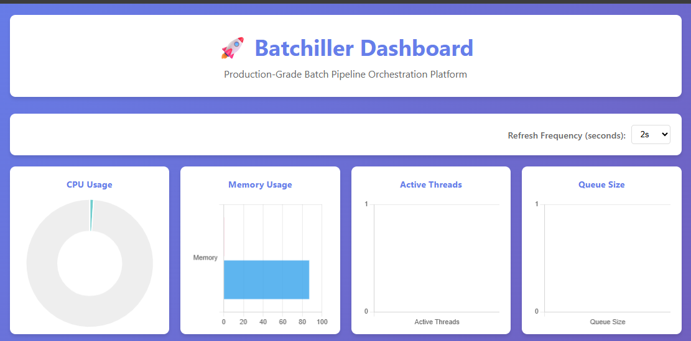
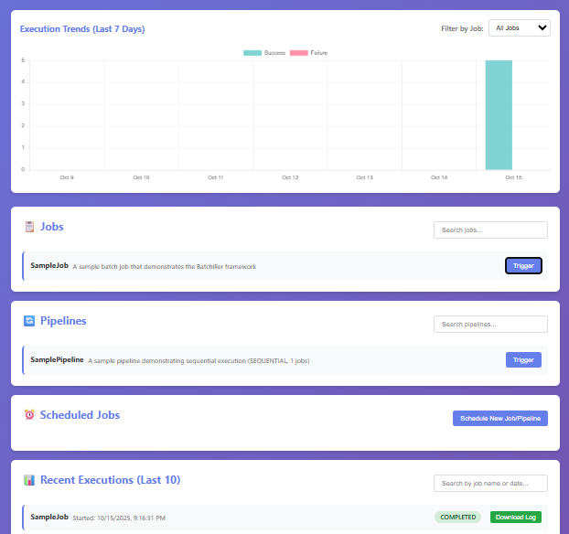

# Batchiller - Asynchronous Multithreaded Batch Pipeline Orchestration Platform

A pure Java-based, asynchronous, multithreaded batch pipeline orchestration platform built with love featuring advanced batch process lifecycle management, hot-swappable job deployment (without server restart), comprehensive event monitoring, and minimal framework dependencies.

### Developed By : Siddharth Mishra [Get In Touch - Linked In](https://www.linkedin.com/in/connect-2-siddharth/)
## 🚀 Features

### Core Capabilities
- **Asynchronous Execution**: Non-blocking job execution using `ThreadPoolExecutor` and `CompletableFuture`
- **Pipeline Orchestration**: Sequential, parallel, and conditional job flows
- **Job Lifecycle Management**: Complete lifecycle hooks (init, beforeStart, afterEnd, shutdown)
- **Event-Driven Monitoring**: Comprehensive event listeners (onStart, onEnd, onPass, onFailed, onRetry, onTimeout, etc.)
- **Hot-Swappable Job Deployment**: Dynamic job loading from individual JAR files with automatic registration
- **Individual Job JARs**: Build system creates separate JAR files for each job implementation
- **Real-time Monitoring**: CPU, memory, and thread metrics via ManagementFactory
- **Job Scheduling**: CRON-based scheduling with Quartz Scheduler
- **Persistent History**: H2 database with configurable retention policies
- **Web Dashboard**: Vanilla JavaScript UI with real-time metrics and working trends visualization
- **CLI Interface**: Command-line tools for job management


### Technology Stack
- **Language**: Java 17+
- **Build**: Maven multi-module project
- **Web Server**: Undertow (lightweight, embedded)
- **Database**: H2 (dev) / MySQL (production)
- **Scheduler**: Quartz
- **CLI**: Picocli
- **Logging**: SLF4J + Logback

## ✔️ Features

### Job Lifecycle Management
Jobs can now implement the `JobLifecycle` interface to receive notifications at different stages:
- **`init(JobContext)`**: Called once when job is loaded/registered
- **`beforeStart(JobContext)`**: Called before each execution attempt
- **`afterEnd(JobContext, JobResult)`**: Called after each execution completes
- **`shutdown(JobContext)`**: Called when job is unloaded or system shuts down

### Enhanced Event Listeners
The new `JobEventListener` interface provides fine-grained event monitoring:
- **`onPending()`**: Job created and pending execution
- **`onQueued()`**: Job queued for execution
- **`onStart()`**: Job execution begins
- **`onEnd()`**: Job execution completes
- **`onPass()`**: Job succeeds
- **`onFailed()`**: Job fails
- **`onRetry()`**: Job is being retried
- **`onTimeout()`**: Job times out
- **`onCancelled()`**: Job is cancelled
- **`onSkipped()`**: Job is skipped

### Individual Job JARs
The build system creates individual JAR files for each job *class* found in the `batchiller-samples` module, rather than a single monolithic JAR for the entire module. This facilitates hot-swapping and granular deployment.
```bash
# Build creates separate JARs for each job class in batchiller-samples
mvn package

# Generated JARs in jobs/ directory (example):
jobs/DataProcessingJob-1.0.0.jar
jobs/ReportGenerationJob-1.0.0.jar
jobs/CpuIntensiveJob-1.0.0.jar
jobs/IoIntensiveJob-1.0.0.jar
jobs/SequentialPipeline-1.0.0.jar
jobs/ParallelPipeline-1.0.0.jar
```

### Hot-Swappable Job Deployment
- Drop new job JARs into the configured `jobs/` directory
- Jobs are automatically detected and registered
- Old versions are gracefully unloaded with lifecycle shutdown hooks
- Zero downtime job updates

### Sample Jobs and Pipelines

Batchiller now includes more complex sample jobs and pipelines to demonstrate its capabilities:

- **`CpuIntensiveJob`**: A job that performs CPU-intensive calculations to simulate compute-heavy tasks.
- **`IoIntensiveJob`**: A job that simulates I/O-bound tasks by sleeping for a few seconds.
- **`SequentialPipeline`**: A pipeline that runs the `CpuIntensiveJob` and `IoIntensiveJob` sequentially.
- **`ParallelPipeline`**: A pipeline that runs the `CpuIntensiveJob` and `IoIntensiveJob` in parallel.

These samples can be found in the `batchiller-samples` module and are packaged into individual JARs for hot-swapping.

### Job Scheduling (UI & API)
- **CRON-based Scheduling**: Schedule any registered job or pipeline to run periodically using standard CRON expressions.
- **Persistence**: Scheduled jobs are persisted in the database and automatically re-scheduled on application startup.
- **Web UI**: A new section in the web dashboard allows users to create, view, edit, and delete scheduled jobs/pipelines.

#### Web UI



#### Artifact References

- **Batchiller Core**
```xml
<dependency>
    <groupId>io.github.siddharth-mishra-28</groupId>
    <artifactId>batchiller-core</artifactId>
    <version>1.0.0</version>
</dependency>
```

- **Batchiller Server**
- This package can be directly downloaded from maven central and run as a standalone executable (details below)
```xml
<dependency>
    <groupId>io.github.siddharth-mishra-28</groupId>
    <artifactId>batchiller-server</artifactId>
    <version>1.0.0</version>
</dependency>
```

## 🏗️ Architecture

### Module Overview

| Module | Purpose | Key Components                           |
|--------|---------|------------------------------------------|
| **batchiller-api** | Core domain & extensibility | Interfaces, models, events, exceptions   |
| **batchiller-server** | Execution engine & UI | Engine, DB, HTTP, monitoring, scheduling |

### Execution Flow
1. Jobs registered with `JobExecutionEngine`
2. Jobs triggered manually or via CRON schedule
3. Async execution in thread pool using `CompletableFuture`
4. Results persisted to database
5. Real-time metrics exposed via REST API
6. Dashboard displays live status

## 🔧 Configuration

Configuration via `batchiller.properties` or environment variables. A sample `batchiller.properties` is also provided in the `batchiller-server` module.

```properties
# Server
server.port=5000
server.host=0.0.0.0

# Database
db.type=h2
db.h2.path=./data/batchiller

# Executor
executor.core.pool.size=10
executor.max.pool.size=50
executor.queue.capacity=100

# Logging & History
log.retention.days=30
job.history.limit=100
log.directory=./logs

# Job Loading & Hot-swapping
jobs.directory=./jobs
jobs.scan.interval.seconds=10
jobs.hotswap.enabled=true
```

## 🚀 Quick Start

### Build
```bash
mvn clean package
```

### Run
```bash
java -jar batchiller-server/target/batchiller-server-1.0.0.jar
```

### Access Dashboard
Open http://localhost:5000 in your browser

### CLI Usage
```bash
# Trigger a job
java -cp batchiller-server/target/batchiller-server-1.0.0.jar \
  com.batchiller.server.cli.BatchillerCLI trigger SampleJob

# View history
java -cp batchiller-server/target/batchiller-server-1.0.0.jar \
  com.batchiller.server.cli.BatchillerCLI history SampleJob --limit 20

# Check status
java -cp batchiller-server/target/batchiller-server-1.0.0.jar \
  com.batchiller.server.cli.BatchillerCLI status
```

## 📊 API Endpoints

| Endpoint | Method | Description |
|----------|--------|-------------|
| `/api/jobs` | GET | List all jobs |
| `/api/jobs/{name}/trigger` | POST | Trigger a job |
| `/api/jobs/{name}/history` | GET | Get job history |
| `/api/pipelines` | GET | List all pipelines |
| `/api/pipelines/{name}/trigger` | POST | Trigger a pipeline |
| `/api/metrics` | GET | Get system metrics |
| `/api/executions` | GET | Get recent executions |
| `/api/scheduled-jobs` | GET | List all scheduled jobs |
| `/api/scheduled-jobs` | POST | Create or update a scheduled job |
| `/api/scheduled-jobs/{id}` | DELETE | Delete a scheduled job |

## 💡 Creating Custom Jobs

### Basic Job Implementation
```java
public class MyCustomJob implements BatchJob {
    @Override
    public String getName() {
        return "MyCustomJob";
    }
    
    @Override
    public String getDescription() {
        return "A custom job implementation";
    }
    
    @Override
    public CompletableFuture<JobResult> execute(JobContext context) {
        return CompletableFuture.supplyAsync(() -> {
            // Your job logic here
            return DefaultJobResult.success("Job completed successfully");
        });
    }
}
```

### Job with Lifecycle Management
```java
public class MyLifecycleJob implements BatchJob, JobLifecycle {
    private DataSource dataSource;
    
    @Override
    public void init(JobContext context) throws Exception {
        // One-time initialization
        dataSource = createDataSource(context.getParameters());
        System.out.println("Job initialized with data source");
    }
    
    @Override
    public void beforeStart(JobContext context) throws Exception {
        // Pre-execution setup
        validateConnection();
        System.out.println("Pre-execution validation completed");
    }
    
    @Override
    public CompletableFuture<JobResult> execute(JobContext context) {
        return CompletableFuture.supplyAsync(() -> {
            // Your job logic here
            return DefaultJobResult.success("Job completed");
        });
    }
    
    @Override
    public void afterEnd(JobContext context, JobResult result) {
        // Post-execution cleanup
        System.out.println("Job finished with status: " + result.getStatus());
    }
    
    @Override
    public void shutdown(JobContext context) {
        // Cleanup resources
        if (dataSource != null) {
            dataSource.close();
        }
        System.out.println("Job resources cleaned up");
    }
}
```

### Custom Event Listener
```java
public class MetricsEventListener implements JobEventListener {
    private final MetricsCollector metrics;
    
    @Override
    public void onStart(JobContext context) {
        metrics.incrementJobStartCounter(context.getJobName());
        metrics.recordJobStartTime(context.getExecutionId(), System.currentTimeMillis());
    }
    
    @Override
    public void onPass(JobContext context, JobResult result) {
        metrics.incrementJobSuccessCounter(context.getJobName());
        recordExecutionTime(context);
    }
    
    @Override
    public void onFailed(JobContext context, JobResult result) {
        metrics.incrementJobFailureCounter(context.getJobName());
        metrics.recordJobError(context.getJobName(), result.getMessage());
    }
}
```

## 💡 Creating Custom Jobs (Legacy)

```java
import com.batchiller.api.*;
import java.util.concurrent.CompletableFuture;

public class MyCustomJob implements BatchJob {
    
    @Override
    public String getName() {
        return "MyCustomJob";
    }
    
    @Override
    public String getDescription() {
        return "My custom batch job";
    }
    
    @Override
    public CompletableFuture<JobResult> execute(JobContext context) {
        return CompletableFuture.supplyAsync(() -> {
            try {
                // Your job logic here
                return JobResult.success("Job completed!");
            } catch (Exception e) {
                return JobResult.failure(e);
            }
        });
    }
}
```

## 🔄 Creating Pipelines

```java
import com.batchiller.api.*;
import java.util.List;

public class MyPipeline implements Pipeline {
    
    @Override
    public String getName() {
        return "MyDataPipeline";
    }
    
    @Override
    public String getDescription() {
        return "ETL pipeline for data processing";
    }
    
    @Override
    public List<BatchJob> getJobs() {
        return List.of(
            new ExtractJob(),
            new TransformJob(),
            new LoadJob()
        );
    }
    
    @Override
    public PipelineFlow getFlow() {
        return PipelineFlow.SEQUENTIAL;
    }
}
```

## 📈 Monitoring

### Real-time Metrics
- CPU utilization (process and system)
- Memory usage (heap and OS)
- Thread pool statistics
- Queue depth and task counts

### Job History
- Execution ID and timestamp
- Duration and status
- Error messages and stack traces
- Thread assignment tracking

## 🛠️ Production Deployment

### Service Wrapper (Linux - systemd)
```ini
[Unit]
Description=Batchiller Orchestration Platform
After=network.target

[Service]
Type=simple
ExecStart=/usr/bin/java -jar /opt/batchiller/batchiller-server-1.0.0.jar
Restart=on-failure
User=batchiller

[Install]
WantedBy=multi-user.target
```

### MySQL Configuration
```properties
db.type=mysql
db.mysql.url=jdbc:mysql://localhost:3306/batchiller
db.mysql.username=batchiller
db.mysql.password=<password>
```

This project is built with ❤ as a testimony to the capabilities of java as an enterprise development stack.
